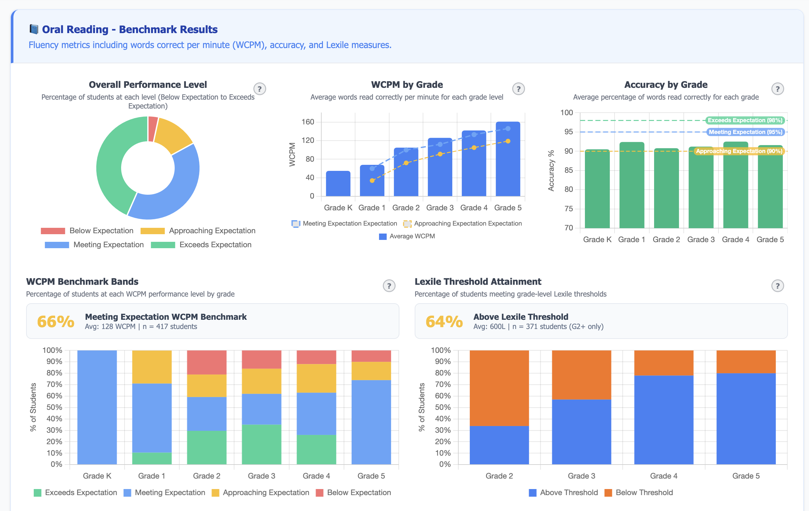
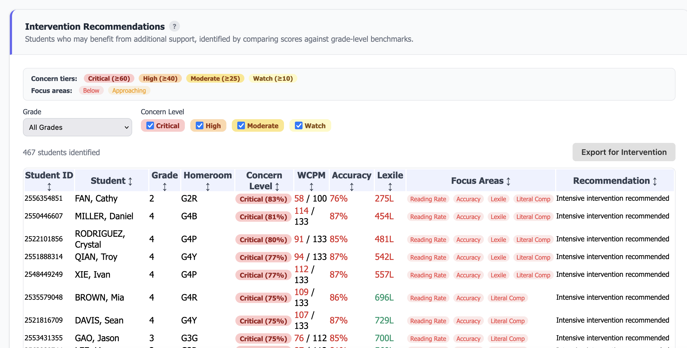

# MAP Growth and Reading Fluency Dashboard

A standalone, browser-based reporting tool for analyzing NWEA **MAP Reading Fluency** and **MAP Growth** assessment data. Built as a single HTML file with no server or installation required — just open it in a browser.

**Video Guides:** [Getting Started](https://youtu.be/UMgL2GXVcGY) | [Overview](https://youtu.be/ED-jufW5shM)

## Features

### Data Import
- **MAP Reading Fluency** — Import `.xlsx` exports directly from NWEA MAP Reading Fluency (supports multi-term files with Fall, Winter, and Spring sheets)
- **MAP Growth** — Import `.csv` exports from NWEA MAP Growth (multiple terms can be loaded)
- **Class List** — Optional sheet to assign students to homerooms (columns: `StudentID`, `HomeroomTeacher`, `ClassName`)
- **Template downloads** — Generate blank CSV or Excel templates for easy data formatting
- Drag-and-drop or click-to-upload file interface

### MAP Growth Views
| View | Description |
|------|-------------|
| **School Dashboard** | School-wide RIT box plots and growth distributions by homeroom, with national norm overlays |
| **Grade Level Report** | Printable per-grade reports with RIT distributions, growth metrics, and met-projection rates |
| **Homeroom Report** | Per-homeroom breakdowns with box plots for RIT scores and observed growth by course |
| **Interventions** | Sortable tables identifying students who did not meet growth projections, filterable by grade and homeroom |

### MAP Reading Fluency Views
| View | Description |
|------|-------------|
| **Benchmark Dashboard** | Foundational Skills domain scores, Phonemic Awareness/Phonics ZPD distributions, WCPM by grade, accuracy stats, Lexile attainment, and Oral Reading expectation levels |
| **Progress Monitoring** | WCPM and accuracy trends over time, Phonemic Awareness and Phonics tracking, distribution charts across terms |
| **Growth Tracking** | Term-over-term growth analysis for WCPM, accuracy, and foundational skill domains |
| **Interventions** | Students flagged for intervention based on benchmark performance, with sortable data tables |
| **Homeroom Report** | Printable per-homeroom foundational skills report cards |

### Student Reports
- **Individual student reports** combining MAP Reading Fluency and MAP Growth data on a single page
- **RF section**: WCPM trend, accuracy trend, Phonemic Awareness and Phonics progress charts
- **MG section**: RIT trend line with national norm band, growth bars (observed vs. projected), and percentile gauge per course
- Search, filter by grade/homeroom, and navigate between students

### Export & Output
- **PDF export** — Download individual student reports as vector PDFs (via jsPDF)
- **Batch PDF-to-ZIP** — Export all student reports as a ZIP of PDFs
- **HTML report export** — Download standalone HTML reports for grade levels and homerooms
- **Batch HTML-to-ZIP** — Export all homeroom or grade-level reports as a ZIP
- **Print-friendly** — All reports include print-optimized CSS

### Data Analysis
- **NWEA national norms** — Configurable norms year (2015, 2020, 2025) for MAP Growth comparisons
- **Percentile calculations** — Normal CDF-based percentile computation from RIT scores and norms
- **Growth projections** — Observed vs. projected growth analysis with met/not-met classification
- **Benchmark classifications** — WCPM benchmark bands and Oral Reading expectation levels using NWEA rules

## Visualizations

Built with **Chart.js 4** and extensions:

- Box plots (RIT score and growth distributions by homeroom)
- Stacked bar charts (benchmark bands, expectation levels)
- Line charts (WCPM/accuracy/RIT trends over time with norm bands)
- Bar charts (growth comparisons, domain scores, ZPD distributions)
- Doughnut charts (Oral Reading expectation breakdowns)
- Gauge/percentile charts (student-level national percentile)
- Distribution charts (Lexile, Phonemic Awareness, Phonics)

## Screenshots

| MAP Growth Dashboard | MAP Reading Fluency Benchmarks | Interventions |
|:---:|:---:|:---:|
|  |  |  |

## Quick Start

1. **Download** `src/MAP_Growth_and_Reading_Fluency_Dashboard.html`
2. **Open** it in any modern browser (Chrome, Edge, Firefox, Safari)
3. **Import data**:
   - Click the import button or drag-and-drop your files
   - Upload MAP Growth CSV exports and/or MAP Reading Fluency Excel exports
   - Optionally include a ClassList sheet for homeroom assignments
4. **Explore** the dashboards, reports, and student views
5. **Export** reports as PDF or HTML

No server, no installation, no internet connection required after the initial page load.

## File Structure

```
MAP_Reading_Fluency_App/
├── src/
│   └── MAP_Growth_and_Reading_Fluency_Dashboard.html   # The entire application
├── data/
│   └── Sample Data/                                 # Sample datasets for testing
│       ├── Sample_MAPReadingFluency.xlsx
│       ├── Sample_MAP_Growth_Fall_2025.csv
│       ├── Sample_MAP_Growth_Winter_2025.csv
│       └── Sample_MAP_Growth_Spring_2026.csv
├── assets/
│   ├── BWYA.png                                     # School logo
│   └── Screenshots/                                 # README screenshots
│       ├── MAP_Growth_Sample.png
│       ├── MAP_Reading_Fluency_Benchmarks_Sample.png
│       └── Interventions_Sample.png
└── README.md
```

## Technology

All libraries are embedded directly in the HTML file for fully offline operation:

| Library | Purpose |
|---------|---------|
| [SheetJS (xlsx.js)](https://sheetjs.com/) | Excel file parsing and template generation |
| [Chart.js 4](https://www.chartjs.org/) | All charts and visualizations |
| [chartjs-chart-boxplot](https://github.com/sgratzl/chartjs-chart-boxplot) | Box plot chart type |
| [chartjs-plugin-annotation](https://www.chartjs.org/chartjs-plugin-annotation/) | Norm lines and reference annotations |
| [jsPDF](https://github.com/parallax/jsPDF) | Vector PDF generation for student reports |
| [jsPDF-AutoTable](https://github.com/simonbengtsson/jsPDF-AutoTable) | Table rendering in PDFs |
| [JSZip](https://stuk.github.io/jszip/) | ZIP file creation for batch exports |
| [FileSaver.js](https://github.com/nicola/filesaver.js/) | Client-side file download |

## Browser Compatibility

Requires a modern browser with ES6+ support:
- Chrome / Edge 80+
- Firefox 78+
- Safari 14+

## Data Privacy

All data processing happens entirely in the browser. **No student data is sent to any server.** Files are parsed client-side using JavaScript, and all reports are generated locally.
